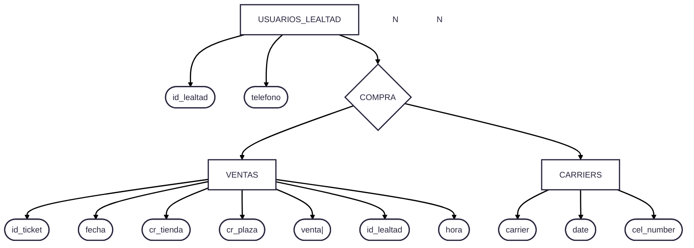

# Universidad Autónoma de Nuevo León, FCFM
## Maestría en Ciencia de Datos
### Base de Datos Relacionales

# **Tarea 2**

```mermaid
---
config:
  theme: redux
  layout: fixed
---
flowchart TD
    n1["VENTAS"] --> n6(["id_ticket"]) & n7(["fecha"]) & n5(["cr_tienda"]) & n4(["cr_plaza"]) & n9(["venta|"]) & n10(["id_lealtad"]) & n8(["hora"])
    n2["CARRIERS"] --> n11(["carrier"]) & n13(["date"]) & n12(["cel_number"])
    n3["USUARIOS_LEALTAD"] --> n14(["id_lealtad"]) & n15(["telefono"]) & n16["COMPRA"]
    n16 --> n1 & n2
    n17["N"]
    n18["N"]
    n1@{ shape: rect}
    n2@{ shape: rect}
    n3@{ shape: rect}
    n16@{ shape: diam}
    n17@{ shape: text}
    n18@{ shape: text}

```

