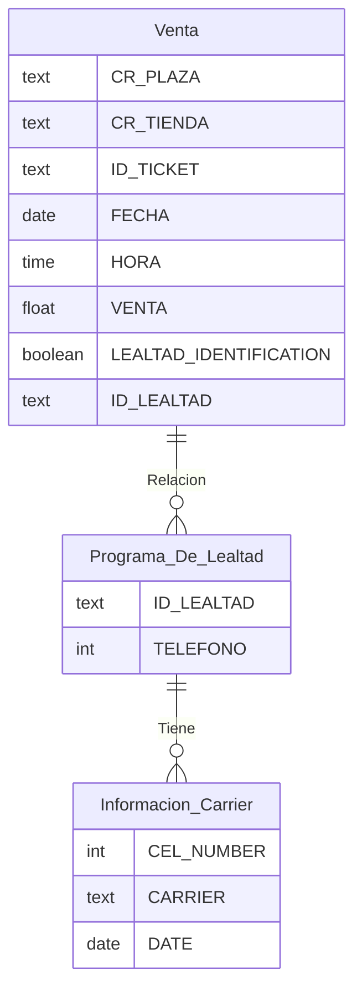

# Universidad Autónoma de Nuevo León, FCFM
## Maestría en Ciencia de Datos
### Base de Datos Relacionales

# **Tarea 3**

### **Esquema del modelo de la base de datos**

### **Tabla Venta**
- CR_PLAZA: text
- CR_TIENDA: text
- ID_TICKET: text
- FECHA: data
- HORA: time
- VENTA: float
- LEALTAD_IDENTIFICATION: boolean
- ID_LEALTAD: text

### **Tabla Información Carrier**
- CEL_NUMBER: int
- CARRIER: text
- DATE: date

### **Tabla Programa de Lealtad**
- ID_LEALTAD: text
- TELEFONO: int

Operaciones con Álgebra Relacional
A continuación se presentan 4 operaciones de álgebra relacional aplicadas a esta base de datos, que permiten obtener información útil sobre las ventas y los usuarios del programa de lealtad.

1. Selección
Consulta: Obtener las ventas realizadas con programa de lealtad activo.
Expresión:
LEALTAD_IDENTIFICATION = true (Venta)

Explicación:
Se seleccionan únicamente los registros de la tabla Venta donde la columna LEALTAD_IDENTIFICATION sea verdadera, es decir, ventas hechas por usuarios con programa de lealtad.

2. Proyección
Consulta: Ver únicamente los teléfonos y carriers de los usuarios.

Expresión:
TELEFONO, CARRIER (Programa_De_Lealtad U Informacion_Carrier)

Explicación:
Se unen las tablas Programa_De_Lealtad y Información Carrier usando TELEFONO = CEL_NUMBER, y se seleccionan solo las columnas TELEFONO y CARRIER.

3. Intersección
Consulta: Obtener los números telefónicos que tienen tanto una venta registrada como información del carrier.

Expresión:
TELEFONO (Programa_De_Lealtad U Venta) ∩  CEL_NUMBER (Información_Carrier)

Explicación:
Se intersectan los números telefónicos que aparecen tanto en la tabla Programa_De_Lealtad con ventas registradas como en la tabla Información Carrier.

4. Unión Natural
Consulta: Ver los detalles de cada venta junto con su carrier.

Expresión:
Venta Programa_De_Lealtad Información_Carrier

Explicación:
Se realiza una unión natural entre las tres tablas utilizando las claves ID_LEALTAD y TELEFONO = CEL_NUMBER, para mostrar en una sola tabla toda la información asociada a cada venta y su carrier.
